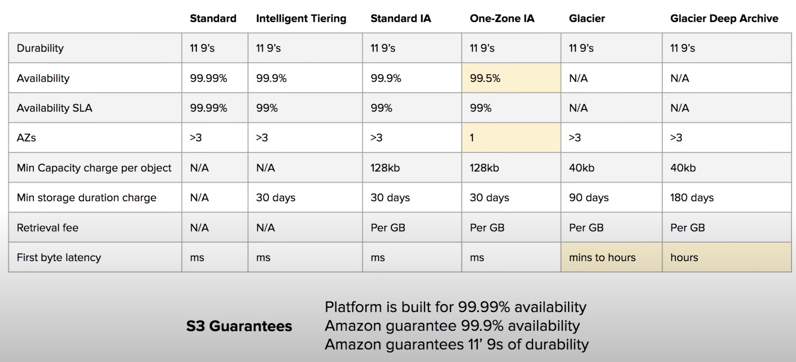
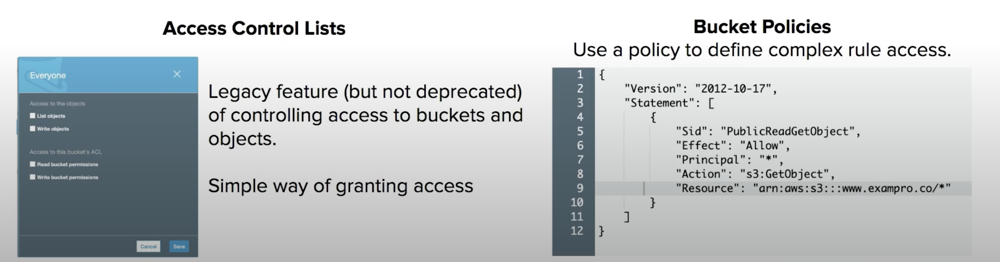

> * Object-based storage service.
> * Provides unlimited storage.
> * Serverless stotrage in the cloud.
> * Don't worry about the file systems or disk space.

### Storage Architecture

> `Object-based` - data storage architecture that manages data as objects.    

> `file systems` - which manages data as a file and file hierarchy.  

> `block storage` - which manages data as blocks within sectors and tracks.

### S3 object
> Objects contain our data. They are like files.  
  Objects may consists of   
  `Key` - name of object    
  `Value` - data itself made up of sequence of bytes.    
  `VersionID` - When versioning enabled, the version of object.   
  `Metadata` - Additional information attached to the object.  

> We can store data from `0 Bytes` to `5 Terabytes` in size.   

### S3 Bucket
> Buckets hold objects.  
> Buckets can also have folders which in turn hold objects.   

### Storage Classes

Trade `Retrieval time, Accessibility and Durability` for `Cheaper Storage` 

> As the type goes down, the cheaper it gets.  

Type | Description
--- | ---
Standard (default) | Fast! 99.99% Availability, 11 9's Durability, Replicates across atleast three AZs
Intelligent Tiering | Uses ML to analyze our object usage and determine the appropriate storage class. Data is moved to most cost-effective access tier, without any performance impact or added overhead.  
Standard Infrequently Accessed (IA) | Still Fast! Cheaper if you access files less than a monthly. Additional retrieval fee is required. **50% less** than standard (reduced availability).  
One Zone IA | Still Fast! Objects only exist in one AZ. Availability (is 99.5%), but cheaper than Standard IA by 20% less (Reduce durability) Data could get destroyed. A retrieval fee is applied. 
Glacier | For long-term cold storage. Retrieval of data can take minutes to hours but the off is very cheap storage. 
Glacier Deep Archive | The lowest cost storage class. Data retrieval time is 12 hours.  

### Storage Class Comparision

### S3 Security

All new buckets are PRIVATE when created by default. 

Logging per request can be turned on a bucket.    
Log files are generated and saved in a different bucket.
(even a bucket in a different AWS account if desired).

Access Control is configured using `bucket policies` and `Access Control Lists (ACLs)`.  

### S3 Encryption

#### Encryption in Transit
Traffic between our local host and s3 is achieved via SSL/TLS

#### Server side encryption (SSE) - Encryption at Rest

`SSE-AES` - S3 handles the key, uses AES-256 algorithm.   
`SSE-KMS` - Envelope encryption, AWS KMS and we manage the keys.  
`SSE-C` - Customer provided key (we manage the keys).  

#### Client-Side Encryption
We encrypt our own files before uploading them to S3.   

### S3 - Data Consistency

New object (PUTS) | Overwrite (PUTS) or Delete Objects (DELETES)
--- | ---
`Read After Write` consistency | `Eventual` consistency
When we upload a new S3 object, we are able to read immediately after writing | When we overwrite or delete an object it takes time for S3 to replicate versions to AZs. If we were to read immediately, S3 may return us an old copy. We need to generally wait for few seconds before reading.  

### S3 - Cross-Region Replication

When CRR is enabled, any object uploaded will be `automatically replicated` to another region(s).   
This provides higher durability and potential disaster recovery for objects.  

We can have CRR replicate to another AWS Account. For this, we must have versioning turned on both the source and destination buckets.

